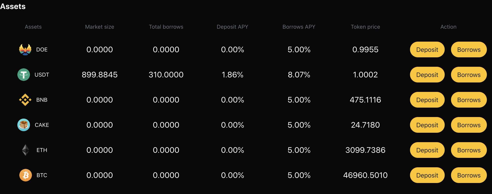

# Borrowing And Repayment

#### 1. How to borrow money?
1. Before you need to borrow money, first ensure that you have deposited the relevant digital currency, then browse to the "supporting assets" section on the home page, and then click "borrow and return" of the asset you want to deposit.  
 
1. Then click the digital currency you have saved, select the corresponding quantity, pay attention to the corresponding risk coefficient, and click the "borrow currency" button. And confirm the transaction.  
   

#### 2. How to return money? 
1. In order to repay the currency, you can browse to the "supporting assets" section on the home page, and then click "borrow / return" of the asset to deposit.  
  
2. Then click the "return currency" button for the asset you borrowed and want to repay. Select the amount to be repaid and confirm the transaction.  
   