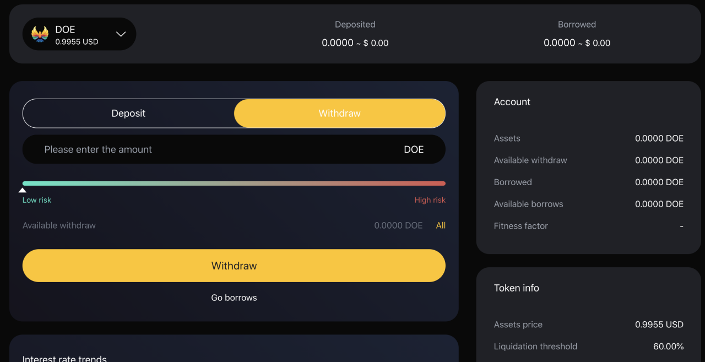

# Deposit and Withdrawal

#### 1. How to deposit encrypted assets?
1. On the home page, browse to the "supporting assets" section, and then click "access" of the asset you want to deposit.   
 
2. Select the asset category and quantity on the details page and submit your transaction. At present, we support digital assets such as doe, BNB, ETH, BTC, cake and usdt.  
 
3. Once the transaction is confirmed, you will begin to earn interest.

#### 2. How to withdraw money?
1. On the home page, browse to the "supporting assets" section, and then click "access" of the asset you want to deposit.  
 
2. Select the asset category and withdrawal quantity on the details page and submit your transaction. The system will display your risk coefficient according to your access.  
 