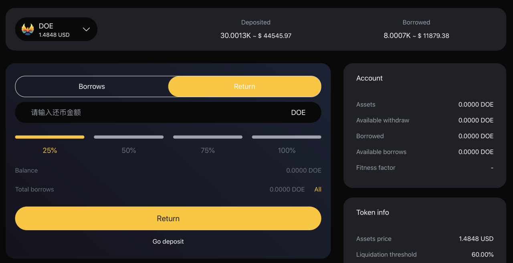

# Borrowings And Repayments

#### 1. LTV interpretation 
The loan to value (LTV) ratio is the financial term of the value ratio of the collateral of the lender's express loan. In other words, the measurement of the loan balance relative to the value of the mortgaged assets is expressed as the loan to value ratio (LTV).
Traditional lenders (such as banks) use your credit score (reported by third-party credit institutions) to determine your reputation. The higher your credit score, the lower the lender's risk.
LTV is calculated as a percentage of the dollar loan amount divided by the dollar collateral value.
example:
Loan amount: USD 5.000;
Collateral value: $10.000;
LTV = ($5.000 / $10.000) * 100% = 50.0%

#### 2. What is the loan to value ratio of my assets?
The loan to value (LTV) ratio is an indicator of the size of the loan compared to the asset value of the secured loan.
The percentage of loan value of each asset is dynamically determined by the DoubleEagle blockchain Oracle algorithm, which depends on the current and historical volatility of the asset and market liquidity.
These are the current loan to value ratios supported by our cryptocurrency:
DOE-50%
BNB-70%
ETH-70%
BTC-70%
CAKE-70%
USDT-70%

#### 3. How can I get the loan qualification?
In order to obtain the loan, the customer should register as a user and deposit the digital assets into the account before borrowing. There is no credit check in DoubleEagle, and we will accept loan requests worldwide.

#### 4. What digital currencies can I use to get double eagle loans?
At present, you can borrow in 6 digital currencies and receive funds on the same day.

#### 5. Can I apply for more than one loan at a time?
As long as you maintain the loan to value ratio and there are enough mortgage assets in your doubleegle account, you can withdraw any number of times from your credit line.

#### 6. What can I do with a double eagle loan?
You are free to allocate funds from the DoubleEagle loan to your specific needs or financial goals. Different borrowers around the world have different requirements and preferences for the service life of Double Eagle loan funds. We know the importance of users getting cash when they need it, which is why we meet the size requirements at the same time so that our customers can pay daily expenses or take advantage of good investment opportunities.

#### 7. How long can I get the loan?
Immediately, no credit check is required, depending on the congestion of BSC.  

#### 8. Do you have a credit check or borrow money from you that will affect my credit score?
With DoubleEagle, no credit check is required and nothing is reported to the credit institution. Your credit score will not be affected. This is one of the main advantages of using DoubleEagle.

#### 9. How much can I borrow?
The maximum amount you can borrow depends on the value of your deposit and the liquidity available. For example, if you don't have enough liquidity or your health factors don't allow you to borrow, you can't borrow. You can find the specific parameters of each available collateral and its borrowing in the risk parameters section.

#### 10. What assets do I need to repay?
You repay your loan with the same assets you borrowed. For example, if you borrow 1 doe, you will repay 1 DOE + accrued interest.

#### 11. How much interest do I have to pay?
The interest rate you pay for borrowing assets depends on the borrowing interest rate, which is derived from the supply-demand ratio of assets. Moreover, the interest rate of variable interest rate is constantly changing, and a stable interest rate provides stability for interest rate. You can find the current borrowing rate in the borrowing section of the dashboard at any time.

#### 12. What is the health coefficient?
Health factor is a digital representation of the security of deposit assets relative to borrowed assets and their underlying value. The higher the value, the safer your capital status in case of liquidation.  

#### 13. What happens when my health decreases?
According to the fluctuation of the value of deposits, health factors will increase or decrease. If your health factor increases, it will improve your borrowing situation and make the liquidation threshold more unlikely to be reached. If the value of mortgaged assets relative to borrowed assets decreases, health factors will also decrease, resulting in increased liquidation risk.  

#### 14. When will I repay the loan?
There is no fixed term for repayment of the loan. As long as your health coefficient is safe, you can borrow an uncertain period. However, over time, accrued interest will increase, reducing your health factors, which may make your deposit assets more likely to be liquidated.  

#### 15. How to borrow money?
1. Before you need to borrow money, first ensure that you have deposited the relevant digital currency, then browse to the "supporting assets" section on the home page, and then click "borrow and return" of the asset you want to deposit.  
 
2. Then click the digital currency you have saved, select the corresponding quantity, pay attention to the corresponding risk coefficient, and click the "borrow currency" button. And confirm the transaction.  
 

#### 16. How to return money?
1. In order to repay the currency, you can browse to the "supporting assets" section on the home page, and then click "borrow / return" of the asset to deposit.  
 
2. Then click the "return currency" button for the asset you borrowed and want to repay. Select the amount to be repaid and confirm the transaction.  
 

