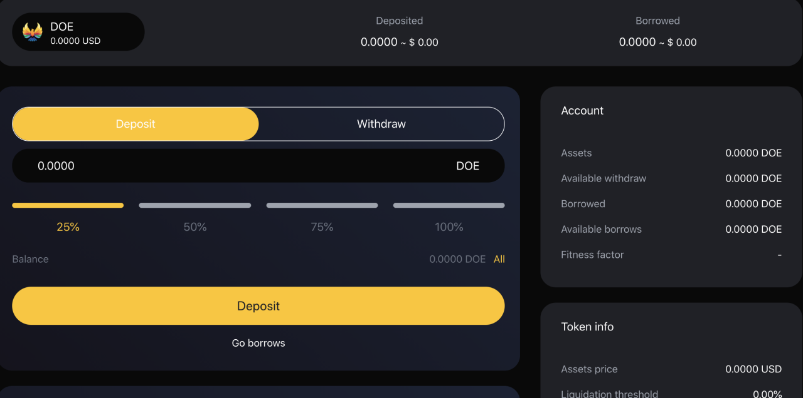
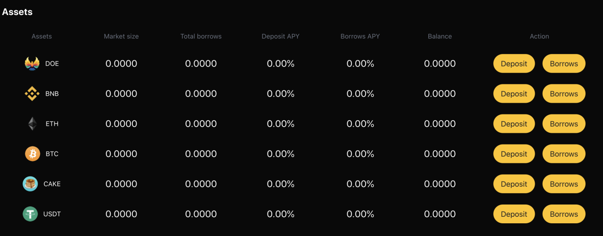
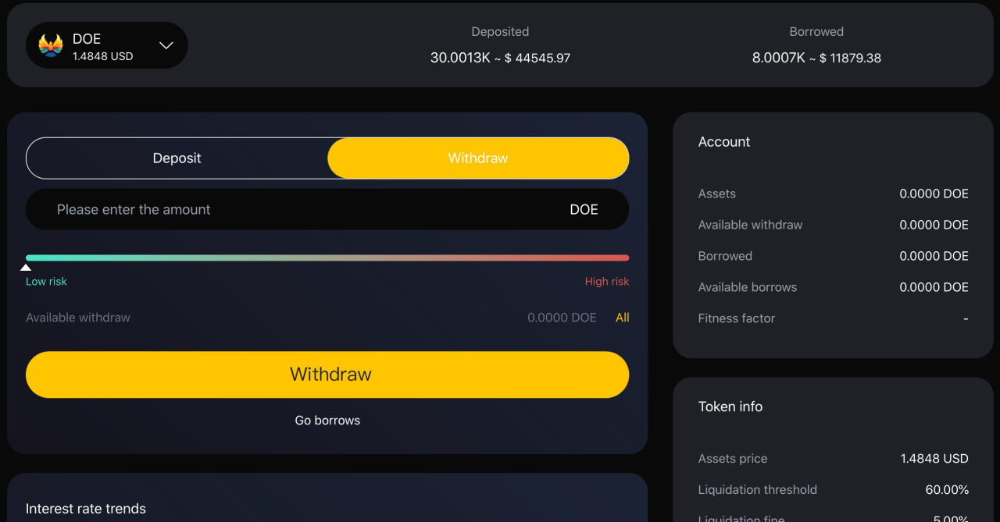

# Deposits And Withdrawals

#### 1. How to deposit encrypted assets?
1. On the home page, browse to the "supporting assets" section, and then click "Deposit" of the asset you want to deposit.  
  
2. Select the asset category and quantity on the details page and submit your transaction. At present, we support digital assets such as DOE, BNB, ETH, BTC, CAKE and USDT.  
  
3. Once the transaction is confirmed, you will begin to earn interest.  

#### 2. How much will I gain?
The continuous income obtained by dtokens holders changes with the change of market conditions. The history of each interest rate in each currency market of DoubleEagle is recorded by the interest rate index. The interest rate index is calculated at each change of interest rate. These changes of interest rate are caused by the provision, withdrawal, borrowing, repayment or liquidation of assets by users. The current interest rate index is also stored worldwide. At the time of each transaction, the supply and borrowing interest rate index of the asset is updated to double eagle's interest since the previous index.  
  

#### 3. Is there a minimum or maximum deposit?
You can deposit any amount, no minimum or maximum. Nevertheless, it is important to consider that for very low amounts, the transaction costs of this process may be higher than the expected benefits. It is recommended to consider this when depositing very low amounts.  

#### 4. How to withdraw money?
1. On the home page, browse to the "supporting assets" section, and then click "Borrows" of the asset you want to borrows.  
 
2. Select the asset category and withdrawal quantity on the details page and submit your transaction. The system will display your risk coefficient according to your access.  

#### 5. Can I cancel the deposit and withdrawal transaction?
Due to the nature of the digital currency protocol, no one, including us, can cancel or revoke encrypted transactions.
 

#### 6. Where is the cryptocurrency after my withdrawal?
Your digital assets will be in your wallet after you withdraw from the DoubleEagle platform.  

