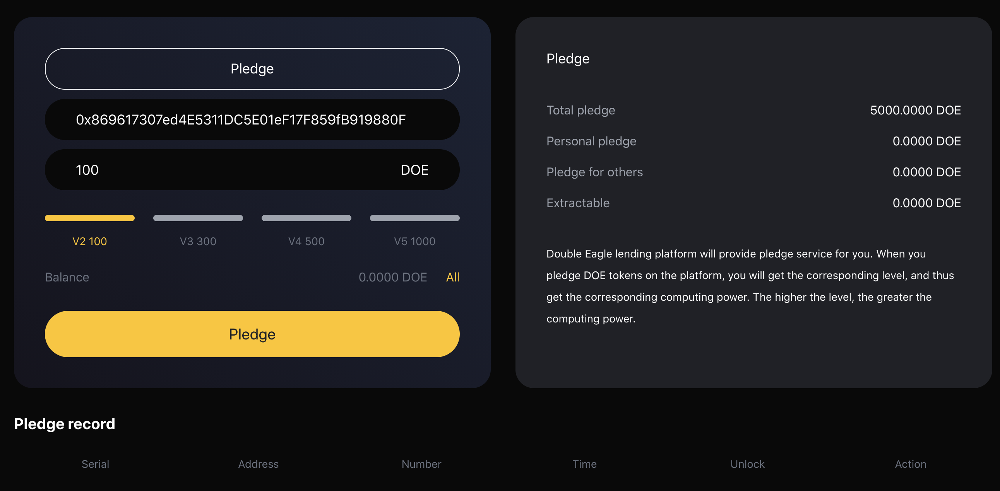

# Pledge

#### 1. What is pledge?
DoubleEagle provides pledge services. Users can pledge DOE tokens on the platform to obtain different levels.
V0-0，V2-100DOE，V3-300DOE，V4-500DOE，V5-1000DOE

#### 2. How to pledge?
1. From the navigation "pledge" to enter the pledge module.  
 
2. Enter the pledge details page, check the professional address, select the pledge level, and click the "pledge" button to complete the operation.  
 
3. In "pledge record", you can see your pledge record.  

#### 3. Can pledged DOE tokens be retrieved?
The pledge period is 540 days and can be retrieved at any time after expiration.

