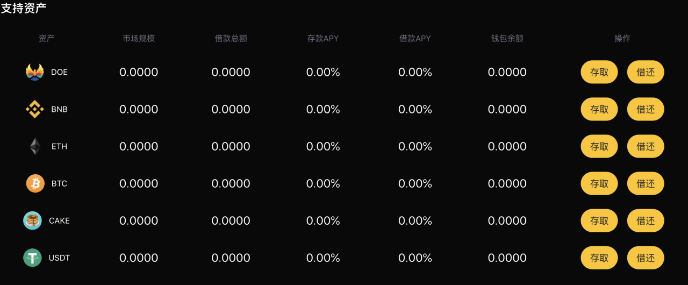
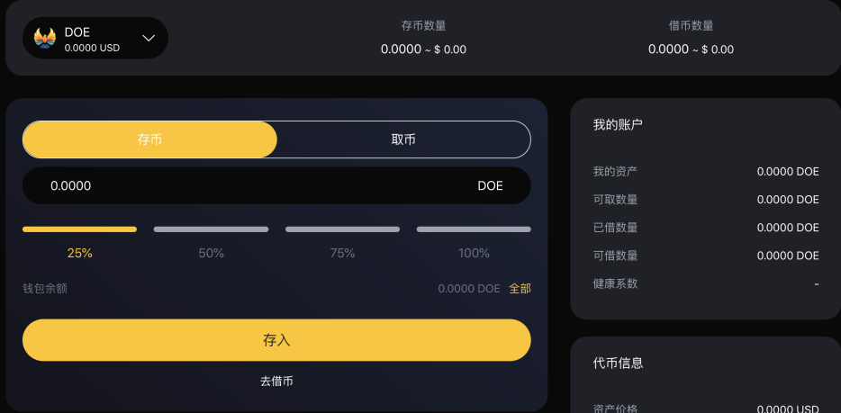
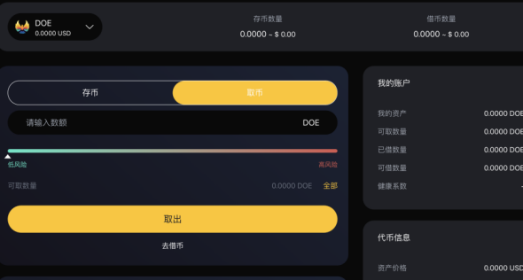

### 存币和取币

1. 如何存入加密资产？
> 1. 首页浏览到“支持资产”部分，然后单击要存款的资产的“存取”。

> 2. （2）在详情页选择资产类别和数量，并提交您的交易，目前我们支持DOE、BNB、ETH、BTC、CAKE、USDT这些数字资产。

> 3. 一旦交易被确认，您将开始赚取利息。

2. 如何取币？
> 1. 首页浏览到“支持资产”部分，然后单击要存款的资产的“存取”。

> 2. 在详情页选择资产类别和提取数量，并提交您的交易，系统会根据您的存取情况来显示您的风险系数。
