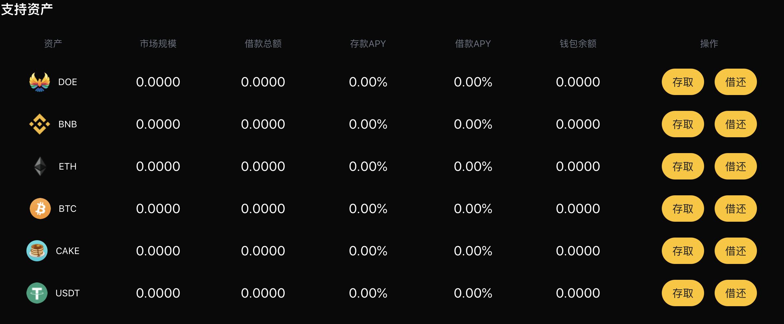
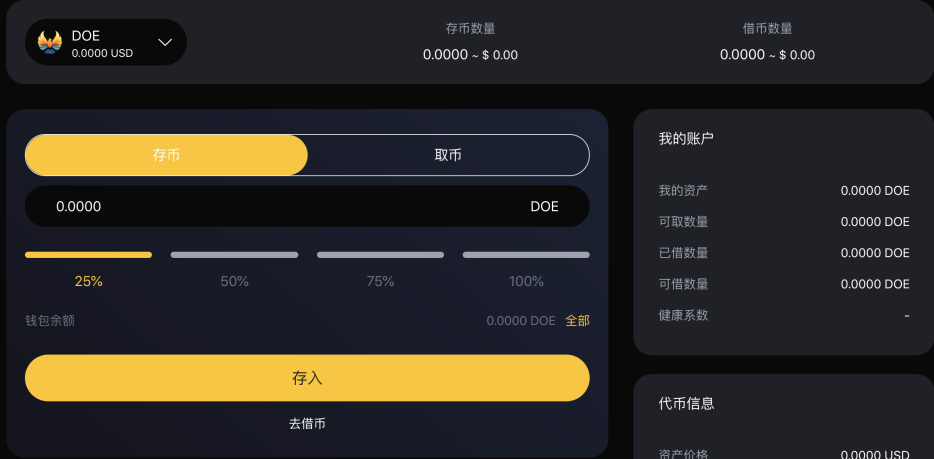
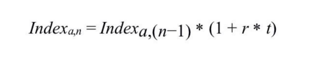

# 存币和取币

#### 如何存入加密资产？
1. 首页浏览到“支持资产”部分，然后单击要存款的资产的“存取”。   

2. 在详情页选择资产类别和数量，并提交您的交易，目前我们支持DOE、BNB、ETH、BTC、CAKE、USDT这些数字资产。  

3. 一旦交易被确认，您将开始赚取利息。   

***
#### 我会有多少收益？
dTokens持有人获得的持续收益随市场条件的变化而变化，DoubleEagle每个货币市场的每个利率的历史都由利率指数记录下来，利率指数是在每次利率变化时计算的，这些利率变化是由用户提供、退出、借款、偿还或清算资产所致。目前的利率指数也在全球范围内存储。 每次交易发生时，该资产的供应和借款利率指数都被更新为DoubleEagle自先前指数以来的利息。   
