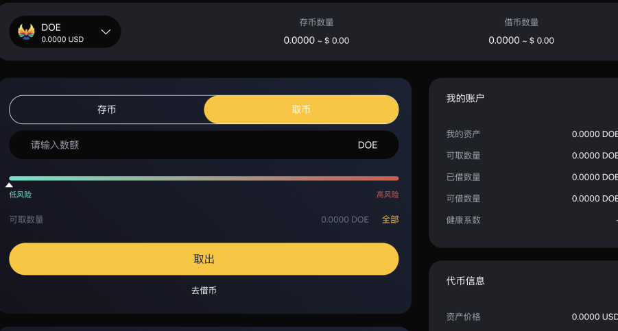

# 存币和取币

#### 如何存入加密资产？
1. 首页浏览到“支持资产”部分，然后单击要存款的资产的“存取”。   

2. 在详情页选择资产类别和数量，并提交您的交易，目前我们支持DOE、BNB、ETH、BTC、CAKE、USDT这些数字资产。  

3. 一旦交易被确认，您将开始赚取利息。   

***
#### 我会有多少收益？
dTokens持有人获得的持续收益随市场条件的变化而变化，DoubleEagle每个货币市场的每个利率的历史都由利率指数记录下来，利率指数是在每次利率变化时计算的，这些利率变化是由用户提供、退出、借款、偿还或清算资产所致。目前的利率指数也在全球范围内存储。 每次交易发生时，该资产的供应和借款利率指数都被更新为DoubleEagle自先前指数以来的利息。   
   

#### 存款有最低限额还是最高限额？
你可以存任何金额，没有最低或最高限额。尽管如此，重要的是要考虑到，对于非常低的金额，这一过程的交易成本可能高于预期收益。建议在存入非常低的金额时考虑这一点。   

#### 如何取款？
1. 首页浏览到“支持资产”部分，然后单击要存款的资产的“存取”。   
   
2. 在详情页选择资产类别和提取数量，并提交您的交易，系统会根据您的存取情况来显示您的风险系数。
  

#### 我可以取消存取款交易吗？
由于数字货币协议的性质，包括我们在内的任何人都无法取消或撤销加密交易。  

#### 6、我的取款之后的加密货币在哪里？
在DoubleEagle平台中执行取款后，您的数字资产将在您的钱包里。   

