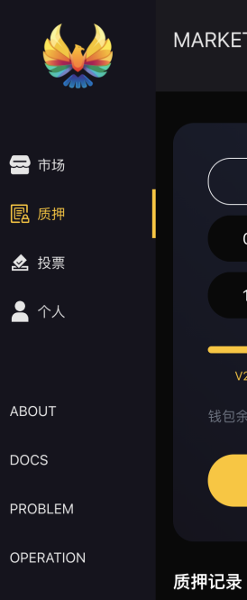
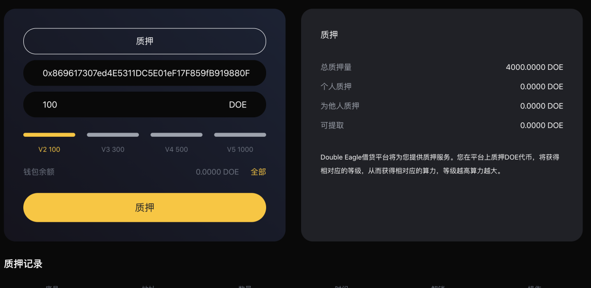

# 质押

#### 1. 什么是质押？
DoubleEagle提供质押服务。用户可在平台质押DOE代币，从而获得不同的等级。
V0-0，V2-100DOE，V3-300DOE，V4-500DOE，V5-1000DOE

#### 2. 如何进行质押？
  1. 从导航“质押”进入到质押模块。   
  
  2. 进入质押详情页，核对职业地址，选择质押等级，点击“质押”按钮，完成操作。   
  
  3. 在“质押记录”你可以看到你的质押记录。

#### 3. 质押的DOE代币是否可以取回？
质押期限为540天，到期之后随时取回。