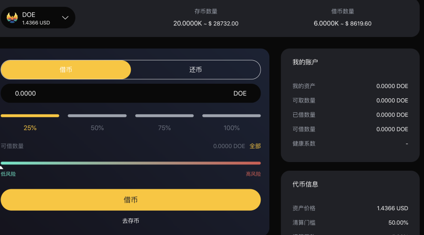
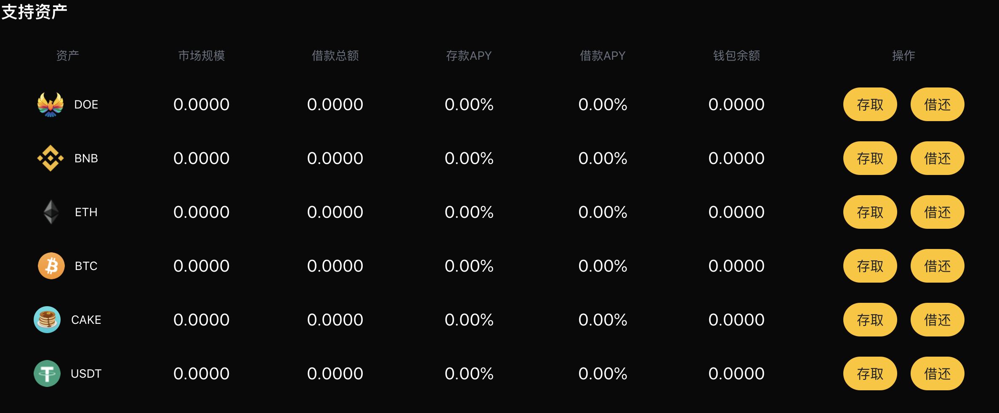
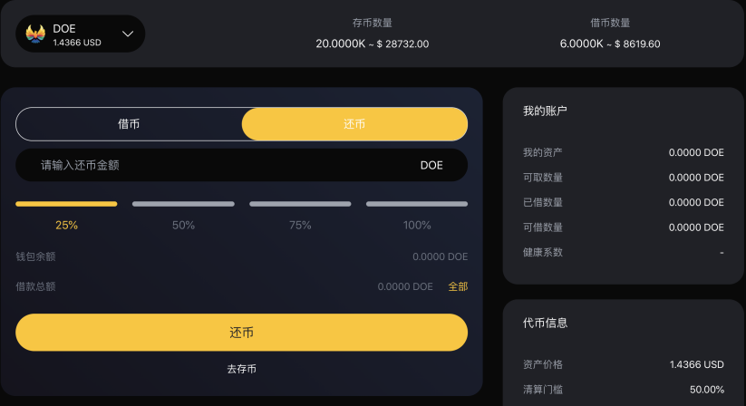

# 借币和还币

#### 如何借币？
1. 您需要借币之前，先保证您已存入相关数字货币，然后您在首页浏览到“支持资产”部分，然后单击要存款的资产的“借还”。

2. 然后单击您已存的数字货币，选择相对应的数量，并注意相对应的风险系数，点击“借币”按钮。并确认交易。

3. 一旦交易被确认，您将开始赚取利息。

#### 如何进行还币？
1. 为了进行还币，您在首页浏览到“支持资产”部分，然后单击要存款的资产的“借还”。

2. 然后单击您所借并想要偿还的资产的“还币”按钮。选择要偿还的金额并确认交易。
