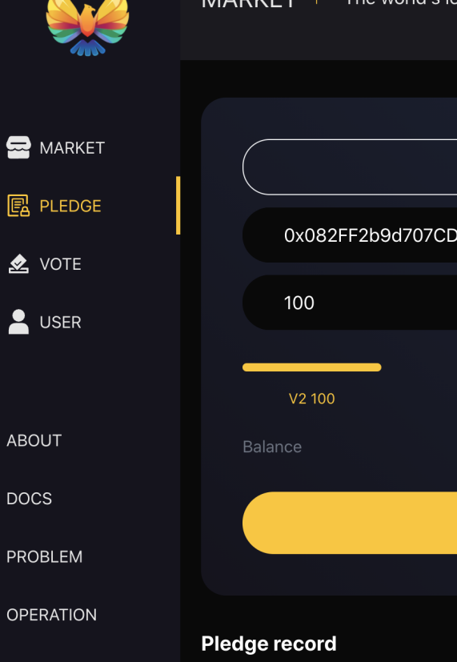
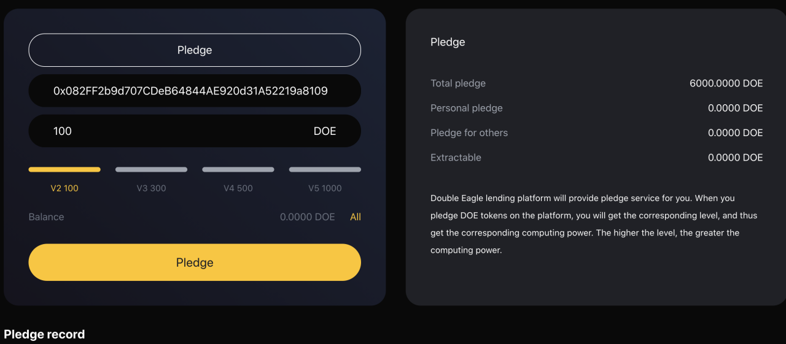

# Double Eagle Operation Document
# Deposit and Withdrawal

#### 1. How to deposit encrypted assets?
1. On the home page, browse to the "supporting assets" section, and then click "access" of the asset you want to deposit.   
 
2. Select the asset category and quantity on the details page and submit your transaction. At present, we support digital assets such as doe, BNB, ETH, BTC, cake and usdt.  
 
3. Once the transaction is confirmed, you will begin to earn interest.

#### 2. How to withdraw money?
1. On the home page, browse to the "supporting assets" section, and then click "access" of the asset you want to deposit.  
 
2. Select the asset category and withdrawal quantity on the details page and submit your transaction. The system will display your risk coefficient according to your access.  
 

# Borrowing And Repayment

#### 1. How to borrow money?
1. Before you need to borrow money, first ensure that you have deposited the relevant digital currency, then browse to the "supporting assets" section on the home page, and then click "borrow and return" of the asset you want to deposit.  
 
1. Then click the digital currency you have saved, select the corresponding quantity, pay attention to the corresponding risk coefficient, and click the "borrow currency" button. And confirm the transaction.  
   

#### 2. How to return money? 
1. In order to repay the currency, you can browse to the "supporting assets" section on the home page, and then click "borrow / return" of the asset to deposit.  
  
2. Then click the "return currency" button for the asset you borrowed and want to repay. Select the amount to be repaid and confirm the transaction.  
   

# Invitation

#### 1. How to invite?
1. Find the "invitation link" from the home page to copy the invitation link and QR code.  
 

# Pledge 

#### 1. How to pledge?
1. From the navigation "pledge" to enter the pledge module.  
  
2. Enter the pledge details page, check the professional address, select the pledge level, and click the "pledge" button to complete the operation.  
 

# Voting Governance

#### 1. How to vote?
1. Navigate to "vote" from the home page to enter the voting page for voting.  
 
2. Select relevant proposals.  
3. Navigate to "vote" from the home page to enter the voting page and vote. You can choose "yes" or "no".  

# Double Eagle Help Center

# Deposits And Withdrawals

#### 1. How to deposit encrypted assets?
1. On the home page, browse to the "supporting assets" section, and then click "Deposit" of the asset you want to deposit.  
  
2. Select the asset category and quantity on the details page and submit your transaction. At present, we support digital assets such as DOE, BNB, ETH, BTC, CAKE and USDT.  
  
3. Once the transaction is confirmed, you will begin to earn interest.  

#### 2. How much will I gain?
The continuous income obtained by dtokens holders changes with the change of market conditions. The history of each interest rate in each currency market of DoubleEagle is recorded by the interest rate index. The interest rate index is calculated at each change of interest rate. These changes of interest rate are caused by the provision, withdrawal, borrowing, repayment or liquidation of assets by users. The current interest rate index is also stored worldwide. At the time of each transaction, the supply and borrowing interest rate index of the asset is updated to double eagle's interest since the previous index.  
  

#### 3. Is there a minimum or maximum deposit?
You can deposit any amount, no minimum or maximum. Nevertheless, it is important to consider that for very low amounts, the transaction costs of this process may be higher than the expected benefits. It is recommended to consider this when depositing very low amounts.  

#### 4. How to withdraw money?
1. On the home page, browse to the "supporting assets" section, and then click "Borrows" of the asset you want to borrows.  
 
2. Select the asset category and withdrawal quantity on the details page and submit your transaction. The system will display your risk coefficient according to your access.  

#### 5. Can I cancel the deposit and withdrawal transaction?
Due to the nature of the digital currency protocol, no one, including us, can cancel or revoke encrypted transactions.
 

#### 6. Where is the cryptocurrency after my withdrawal?
Your digital assets will be in your wallet after you withdraw from the DoubleEagle platform.  

# Borrowings And Repayments

#### 1. LTV interpretation 
The loan to value (LTV) ratio is the financial term of the value ratio of the collateral of the lender's express loan. In other words, the measurement of the loan balance relative to the value of the mortgaged assets is expressed as the loan to value ratio (LTV).
Traditional lenders (such as banks) use your credit score (reported by third-party credit institutions) to determine your reputation. The higher your credit score, the lower the lender's risk.
LTV is calculated as a percentage of the dollar loan amount divided by the dollar collateral value.
example:
Loan amount: USD 5.000;
Collateral value: $10.000;
LTV = ($5.000 / $10.000) * 100% = 50.0%

#### 2. What is the loan to value ratio of my assets?
The loan to value (LTV) ratio is an indicator of the size of the loan compared to the asset value of the secured loan.
The percentage of loan value of each asset is dynamically determined by the DoubleEagle blockchain Oracle algorithm, which depends on the current and historical volatility of the asset and market liquidity.
These are the current loan to value ratios supported by our cryptocurrency:
DOE-50%
BNB-70%
ETH-70%
BTC-70%
CAKE-70%
USDT-70%

#### 3. How can I get the loan qualification?
In order to obtain the loan, the customer should register as a user and deposit the digital assets into the account before borrowing. There is no credit check in DoubleEagle, and we will accept loan requests worldwide.

#### 4. What digital currencies can I use to get double eagle loans?
At present, you can borrow in 6 digital currencies and receive funds on the same day.

#### 5. Can I apply for more than one loan at a time?
As long as you maintain the loan to value ratio and there are enough mortgage assets in your doubleegle account, you can withdraw any number of times from your credit line.

#### 6. What can I do with a double eagle loan?
You are free to allocate funds from the DoubleEagle loan to your specific needs or financial goals. Different borrowers around the world have different requirements and preferences for the service life of Double Eagle loan funds. We know the importance of users getting cash when they need it, which is why we meet the size requirements at the same time so that our customers can pay daily expenses or take advantage of good investment opportunities.

#### 7. How long can I get the loan?
Immediately, no credit check is required, depending on the congestion of BSC.  

#### 8. Do you have a credit check or borrow money from you that will affect my credit score?
With DoubleEagle, no credit check is required and nothing is reported to the credit institution. Your credit score will not be affected. This is one of the main advantages of using DoubleEagle.

#### 9. How much can I borrow?
The maximum amount you can borrow depends on the value of your deposit and the liquidity available. For example, if you don't have enough liquidity or your health factors don't allow you to borrow, you can't borrow. You can find the specific parameters of each available collateral and its borrowing in the risk parameters section.

#### 10. What assets do I need to repay?
You repay your loan with the same assets you borrowed. For example, if you borrow 1 doe, you will repay 1 DOE + accrued interest.

#### 11. How much interest do I have to pay?
The interest rate you pay for borrowing assets depends on the borrowing interest rate, which is derived from the supply-demand ratio of assets. Moreover, the interest rate of variable interest rate is constantly changing, and a stable interest rate provides stability for interest rate. You can find the current borrowing rate in the borrowing section of the dashboard at any time.

#### 12. What is the health coefficient?
Health factor is a digital representation of the security of deposit assets relative to borrowed assets and their underlying value. The higher the value, the safer your capital status in case of liquidation.  

#### 13. What happens when my health decreases?
According to the fluctuation of the value of deposits, health factors will increase or decrease. If your health factor increases, it will improve your borrowing situation and make the liquidation threshold more unlikely to be reached. If the value of mortgaged assets relative to borrowed assets decreases, health factors will also decrease, resulting in increased liquidation risk.  

#### 14. When will I repay the loan?
There is no fixed term for repayment of the loan. As long as your health coefficient is safe, you can borrow an uncertain period. However, over time, accrued interest will increase, reducing your health factors, which may make your deposit assets more likely to be liquidated.  

#### 15. How to borrow money?
1. Before you need to borrow money, first ensure that you have deposited the relevant digital currency, then browse to the "supporting assets" section on the home page, and then click "borrow and return" of the asset you want to deposit.  
 
2. Then click the digital currency you have saved, select the corresponding quantity, pay attention to the corresponding risk coefficient, and click the "borrow currency" button. And confirm the transaction.  
 

#### 16. How to return money?
1. In order to repay the currency, you can browse to the "supporting assets" section on the home page, and then click "borrow / return" of the asset to deposit.  
 
2. Then click the "return currency" button for the asset you borrowed and want to repay. Select the amount to be repaid and confirm the transaction.  
 

# Liquidation

#### 1. What is liquidation?
Liquidation is a process that occurs when the borrower's health factor is lower than 1, because its collateral value cannot properly cover its loan / debt value. This may occur when the value of collateral decreases or when the value of borrowed debt increases with each other. The ratio of collateral to loan value is shown in the health factor.
In the liquidation, 100% liquidation will be carried out to pay all the debts of the borrower, and the value + liquidation fee will be withdrawn from the available collateral. Therefore, after liquidation, the amount liquidated from your debt will be repaid.

#### 2. How to avoid liquidation?
You can avoid paying off more of your assets by depositing or liquidating more of your assets. By default, repayment can increase your health factor more than deposit. In addition, it is important to monitor your health factor and keep it high to avoid liquidation. For example, keeping your health factor above 2 will give you more room to avoid liquidation.

# Pledge

#### 1. What is pledge?
DoubleEagle provides pledge services. Users can pledge DOE tokens on the platform to obtain different levels.
V0-0，V2-100DOE，V3-300DOE，V4-500DOE，V5-1000DOE

#### 2. How to pledge?
1. From the navigation "pledge" to enter the pledge module.  
 
2. Enter the pledge details page, check the professional address, select the pledge level, and click the "pledge" button to complete the operation.  
 
3. In "pledge record", you can see your pledge record.  

#### 3. Can pledged DOE tokens be retrieved?
The pledge period is 540 days and can be retrieved at any time after expiration.

# Voting Governance

#### 1. What is governance voting?
DoubleEagle hopes to establish a long-term Dao governance framework, relying on systematic incentives and multi-level governance to stimulate the long-term growth and optimization of the agreement.Each DOE token holder has corresponding key decision-making rights for each scheme. By voting on the scheme, they exercise governance power, such as changes, improvements and decisions on the core elements of the system, including risk control factors, underlying assets and interest rate models.  

#### 2. Governance voting process?
1. The Governance Forum initiated discussion and gradually improved to form a formal proposal.
2. Submit to DoubleEagle for voting approval.
3. The voting results are valid and executed.

#### 3. Can I add more DOE tokens to my vote?
Yes, voting again will reflect your new token count.

# Security

#### 1. How is my data protected?
Your personal information is included in the secure network. Only a few people who have special access to such systems and need to keep the information confidential can access it. In addition, all sensitive / credit information you provide is encrypted through secure socket layer (SSL) technology.
In order to maintain the security of your personal information, we have implemented various security measures when users enter, submit or access their information.

#### 2. If I find anything suspicious on the DoubleEagle platform, where should I submit it?
If you find anything suspicious on the DoubleEagle platform, please report it to admin@DoubleEagle.io.

#### 3. How to protect the security of smart contracts?
The smart contract security of DoubleEagle platform is mainly guaranteed in the following three aspects:
Experienced contract developers: all DoubleEagle contract developers have extensive industry experience. They are very familiar with various disclosed contract loopholes. In technical cooperation with other teams, they found various security vulnerabilities.
Multiple audit mechanism: before the formal launch of the smart contract of DoubleEagle platform, it will be comprehensively audited by at least one well-known security organization in the industry, and different modules will also be subject to internal cross audit. Double test the security of online code through internal review meeting, simulated security attack and defense and other forms to eliminate possible security risks and logic vulnerabilities.   