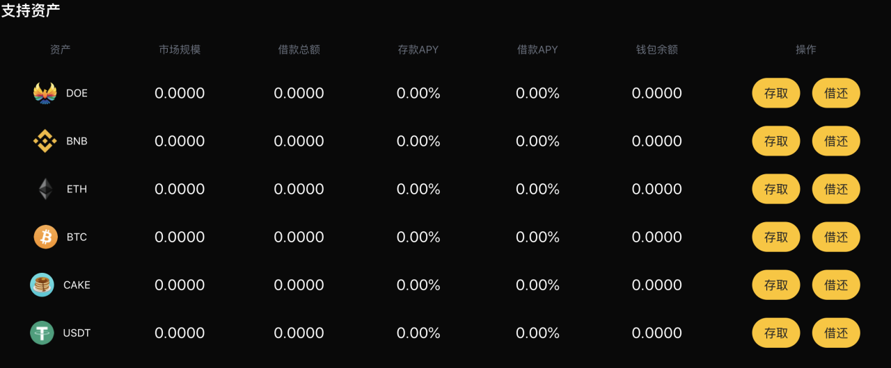
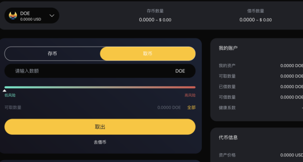
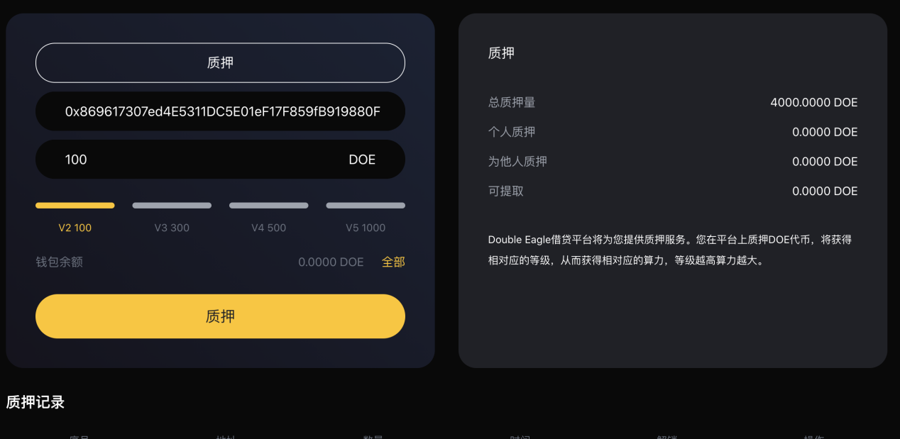
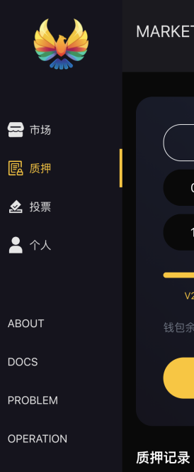

# Double Eagle操作文档
# 存币和取币

#### 1. 如何存入加密资产？
1. 首页浏览到“支持资产”部分，然后单击要存款的资产的“存取”。

2. （2）在详情页选择资产类别和数量，并提交您的交易，目前我们支持DOE、BNB、ETH、BTC、CAKE、USDT这些数字资产。

3. 一旦交易被确认，您将开始赚取利息。

#### 2. 如何取币？
1. 首页浏览到“支持资产”部分，然后单击要存款的资产的“存取”。

2. 在详情页选择资产类别和提取数量，并提交您的交易，系统会根据您的存取情况来显示您的风险系数。

# 借币和还币

#### 1. 如何借币？
1. 您需要借币之前，先保证您已存入相关数字货币，然后您在首页浏览到“支持资产”部分，然后单击要存款的资产的“借还”。

2. 然后单击您已存的数字货币，选择相对应的数量，并注意相对应的风险系数，点击“借币”按钮。并确认交易。

3. 一旦交易被确认，您将开始赚取利息。

#### 2. 如何进行还币？
1. 为了进行还币，您在首页浏览到“支持资产”部分，然后单击要存款的资产的“借还”。

2. 然后单击您所借并想要偿还的资产的“还币”按钮。选择要偿还的金额并确认交易。

# 邀请

#### 如何进行邀请？
1. 从首页找到“邀请链接”，可以复制邀请链接和二维码  

# 质押

#### 如何进行质押？
1. 从导航“质押”进入到质押模块。    

2. 进入质押详情页，核对职业地址，选择质押等级，点击“质押”按钮，完成操作。  

3. 在“质押记录”你可以看到你的质押记录。  

# 投票

#### 如何进行投票？
1. 从首页导航找到“投票”，从而进入投票页面，进行投票。  

2. 选择相关提案  
3. 从首页导航找到“投票”，从而进入投票页面，进行投票，您可以选择“赞成”或“反对”。

***
# Double Eagle帮助中心

# 存币和取币

#### 如何存入加密资产？
1. 首页浏览到“支持资产”部分，然后单击要存款的资产的“存取”。   

2. 在详情页选择资产类别和数量，并提交您的交易，目前我们支持DOE、BNB、ETH、BTC、CAKE、USDT这些数字资产。  

3. 一旦交易被确认，您将开始赚取利息。   

***
#### 我会有多少收益？
dTokens持有人获得的持续收益随市场条件的变化而变化，DoubleEagle每个货币市场的每个利率的历史都由利率指数记录下来，利率指数是在每次利率变化时计算的，这些利率变化是由用户提供、退出、借款、偿还或清算资产所致。目前的利率指数也在全球范围内存储。 每次交易发生时，该资产的供应和借款利率指数都被更新为DoubleEagle自先前指数以来的利息。   
   

#### 存款有最低限额还是最高限额？
你可以存任何金额，没有最低或最高限额。尽管如此，重要的是要考虑到，对于非常低的金额，这一过程的交易成本可能高于预期收益。建议在存入非常低的金额时考虑这一点。   

#### 1. 如何取款？
1. 首页浏览到“支持资产”部分，然后单击要存款的资产的“存取”。   
   
2. 在详情页选择资产类别和提取数量，并提交您的交易，系统会根据您的存取情况来显示您的风险系数。
  

#### 2. 我可以取消存取款交易吗？
由于数字货币协议的性质，包括我们在内的任何人都无法取消或撤销加密交易。  

#### 3. 我的取款之后的加密货币在哪里？
在DoubleEagle平台中执行取款后，您的数字资产将在您的钱包里。   

# 借币和还币

#### 1. 贷款价值比 (LTV) 解释
该贷款与价值（LTV）比率是贷款人利用快递贷款的抵押品的价值比财务条款。换句话说，相对于抵押资产价值的贷款余额的衡量表示为贷款价值比 (LTV)。   

传统贷方（例如银行）使用您的信用评分（由第三方信用机构报告）来确定您的信誉。您的信用评分越高，贷方的风险就越低。   

LTV 计算为美元贷款金额除以美元抵押品价值，以百分比表示。

例子：
贷款金额：  5.000 美元；
抵押品价值： 10.000 美元；
贷款价值比= ($5.000/$10.000)*100% = 50.0%

#### 2. 我的资产可以获得什么贷款价值比？
贷款价值 (LTV) 比率是表示贷款规模与担保贷款的资产价值相比的指标。
每个资产的贷款价值百分比由DoubleEagle区块链预言机算法动态确定，具体取决于资产的当前和历史波动率以及市场流动性。
这些是我们加密货币支持的当前贷款价值比：
DOE-50%
BNB-70%
ETH-70%
BTC-70%
CAKE-70%
USDT-70%

#### 3. 如何才能获得借款资格？
为了获得借款，客户应在借款之前注册成为用户并将数字资产存入账户。在DoubleEagle没有信用检查，我们将在全球范围内接受借款请求。  

#### 4. 我可以使用哪些数字货币获得DoubleEagle借款？
目前您可以以 6种数字货币进行借款，并在同一天收到资金。

#### 5. 我可以一次申请多于一笔贷款吗？
只要您保持借款价值比，并且您的DoubleEagle账户中有足够的抵押资产，您就可以从您的信用额度中提取任意次数。  

#### 6. 我可以用DoubleEagle借款做什么？
您可以自由地将DoubleEagle贷款中的资金分配给您的特定需求或财务目标。世界各地的不同借款人对 DoubleEagle贷款资金的使用期限有不同的要求和偏好。我们知道用户在需要时获得现金的重要性，这就是为什么我们同时满足大小要求，以便我们的客户可以支付日常费用或利用良好的投资机会。

#### 7. 多久可以获得借款？
立刻马上，无需信用检查，取决于BSC的拥堵情况。

#### 8. 您是否有信用检查或向您借款会影响我的信用评分？
使用DoubleEagle，无需进行信用检查，也不会向信用机构报告任何内容。您的信用评分不会受到任何影响。这是使用DoubleEagle的主要优点之一。   

#### 9. 我能获得多少借款？
你可以借的最大金额取决于你的存款价值和可用的流动性。例如，如果没有足够的流动性或者你的健康因素不允许你借款，你就不能借款。你可以在风险参数部分找到每一个可用的抵押品及其借款的具体参数。

#### 10. 我需要偿还什么资产？
你用你借来的同样的资产偿还你的借款。例如，如果你借1 DOE，你将偿还1 DOE+应计利息。   

#### 11. 我需支付多少借款利息？
你为借款资产支付的利率取决于借款利率，而借款利率是由资产的供求比率得出的。而且，可变利率的利率是不断变化的，而稳定的利率为利率提供了稳定性。您可以随时在仪表板的借款部分找到当前借款利率。

#### 12. 什么是健康系数？
健康系数是存款资产相对于借入资产及其基础价值的安全性的数字表示。价值越高，您的资金状态就越安全，以防出现清算情况。

#### 13. 当我的健康系数降低时会发生什么？
根据存款的价值波动，健康因素会增加或减少。如果你的健康因素增加，它将改善你的借款情况，使清算阈值更不可能达到。如果抵押资产相对于借入资产的价值反而降低，健康因素也会降低，从而导致清算风险增加。

#### 14. 我什么时候归还借款？
偿还借款没有固定期限。只要你的健康系数是安全的，你可以借一个不确定的时期。然而，随着时间的推移，应计利息将增长，使您的健康因素减少，这可能会导致您的存款资产变得更有可能被清算。

#### 15. 如何进行借币？
  1. 您需要借币之前，先保证您已存入相关数字货币，然后您在首页浏览到“支持资产”部分，然后单击要存款的资产的“借还”。
    
  2. 然后单击您已存的数字货币，选择相对应的数量，并注意相对应的风险系数，点击“借币”按钮。并确认交易。
    

#### 16. 如何进行还币？
  1. 为了进行还币，您在首页浏览到“支持资产”部分，然后单击要存款的资产的“借还”。  
    
  2. 然后单击您所借并想要偿还的资产的“还币”按钮。选择要偿还的金额并确认交易。  
  

# 清算

#### 1. 什么是清算？
清算是当借款人的健康系数低于1时发生的一个过程，这是由于其抵押品价值不能恰当地覆盖其贷款/债务价值。这可能发生在抵押品价值下降或借入的债务相互之间价值增加时。抵押物与贷款价值的比率显示在健康系数中。
在清算中，进行100%清算，把借款人的欠款全部还完，价值+清算费从可用抵押品中提取，因此在清算后，从您的债务中清算的金额将得到偿还。 

#### 2. 如何避免清算？
为了避免清算，你可以通过存入更多的抵押资产或偿还部分贷款来提高你的健康系数。默认情况下，还款比存款更能增加你的健康因素。此外，重要的是要监测你的健康因素，并保持它高，以避免清算。例如，将你的健康系数保持在2以上，会给你更多的余地，以避免清算。  

# 质押

#### 1. 什么是质押？
DoubleEagle提供质押服务。用户可在平台质押DOE代币，从而获得不同的等级。
V0-0，V2-100DOE，V3-300DOE，V4-500DOE，V5-1000DOE

#### 2. 如何进行质押？
  1. 从导航“质押”进入到质押模块。   
  
  2. 进入质押详情页，核对职业地址，选择质押等级，点击“质押”按钮，完成操作。   
  
  3. 在“质押记录”你可以看到你的质押记录。

#### 3. 质押的DOE代币是否可以取回？
质押期限为540天，到期之后随时取回。

# 投票

#### 1. 什么是治理投票？
DoubleEagle希望建立一个长期的 DAO 治理框架，依靠系统性激励和多层次治理来刺激协议的长期增长和优化。
每个DOE代币持有者对每个方案都有相应的关键决策权。通过对方案进行投票，他们行使治理权力，例如对系统核心要素的变更、改进和决策，包括风险控制因素、基础资产和利率模型等。

#### 2. 治理投票的流程？
  1. 治理论坛发起讨论并逐步完善，形成正式的提案。
  2. 提交给DoubleEagle进行投票批准。
  3. 投票结果有效并执行。

#### 3. 我可以在我的投票中添加更多DOE代币吗？
是的，再次投票将反映您的新代币数量。

# 安全

#### 1. 我的数据如何受到保护？
您的个人信息包含在安全网络之后，只有少数对此类系统具有特殊访问权限并需要对信息保密的人才能访问。此外，您提供的所有敏感/信用信息均通过安全套接字层 (SSL) 技术进行加密。
为了维护您个人信息的安全，我们在用户输入、提交或访问他们的信息时实施了各种安全措施。

#### 2. 如果我在 DoubleEagle平台上发现任何可疑情况，我应该在哪里进行提交？
如果您在DoubleEagle平台上发现任何可疑情况，请将其报告给admin@DoubleEagle.io。

#### 3. 如何保障智能合约的安全？
DoubleEagle平台的智能合约安全主要有以下三个方面的保障：
经验丰富的合同开发人员：所有DoubleEagle合同开发人员都具有丰富的行业经验。他们非常熟悉各种已披露的合同漏洞。在与其他团队的技术合作中，他们发现了各种不同的安全漏洞。
多重审核机制：DoubleEagle平台的智能合约在正式推出前，至少会经过一家业内知名安全机构的全面审核，不同模块也会进行内部交叉审核。通过内部评审会、模拟安全攻防等多种形式对在线代码的安全性进行双重测试，消除可能存在的安全风险和逻辑漏洞。

